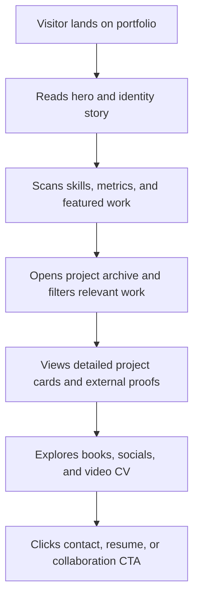

## 1. Product Overview
An editorial portfolio website for Himadri Jain that transforms the provided presentation and video CV into a polished digital presence for recruiters, collaborators, brands, and publishing audiences.
- The website presents Himadri as an author, digital storyteller, content strategist, and campaign-minded creative with proof across books, social platforms, brand work, writing, and multimedia.
- The product value is a shareable, conversion-oriented portfolio that goes beyond slides by offering a memorable identity, structured project discovery, and direct pathways to contact, resume, and external work.

## 2. Core Features

### 2.1 Feature Module
1. **Home page**: immersive hero, identity narrative, signature skills, social proof, featured projects, sticky navigation, contact CTA
2. **Work archive page**: filterable project cards, campaign case-study highlights, writing and paid project blocks, external proof links
3. **Media and contact page**: books showcase, social platform cards, embedded video CV, downloadable resume CTA, collaboration/contact section

### 2.2 Page Details
| Page Name | Module Name | Feature description |
|-----------|-------------|---------------------|
| Home page | Hero introduction | Displays Himadri Jain, positioning statement, portrait, primary CTAs for work, resume, and contact |
| Home page | Story section | Converts the "Who Am I?" narrative into a readable editorial introduction with campaign-meets-poetry framing |
| Home page | Skills strip | Highlights brand management, social media, design, writing, campaign ideation, strategy, content creation, and creative direction |
| Home page | Experience snapshot | Shows professional and volunteering achievements including 100+ contents, 50+ conversions, and 200K+ organic reach |
| Home page | Featured work rail | Spotlights Flea Mania Anthem, Netflix Passport, TV ad production, Diwali social strategy, and writing work with quick summaries |
| Work archive page | Filter bar | Lets users filter projects by campaign, social strategy, writing, production, paid projects, and self-initiated work |
| Work archive page | Project cards | Displays project overview, role, deliverables, skills used, and external links to YouTube, Canva, Spotify, Instagram, or Drive where available |
| Work archive page | Detailed storytelling panels | Expands each key project into challenge, contribution, craft, and outcome sections based on extracted source content |
| Work archive page | Writing and paid work grid | Organizes IFP writing, podcast scripting, poem writing, reel scripting, and restaurant content writing into proof-driven cards |
| Media and contact page | Books showcase | Features both books with cover imagery, short descriptions, and Amazon purchase links |
| Media and contact page | Social ecosystem | Presents Instagram, YouTube, and LinkedIn as distinct content channels with tailored descriptions |
| Media and contact page | Video CV section | Embeds or locally hosts the provided MP4 so visitors can watch the portfolio story in motion |
| Media and contact page | Contact conversion block | Offers phone, email, city, resume access, and video CV access in one action-oriented section |

## 3. Core Process
Visitors land on a strong personal narrative, understand Himadri's multidisciplinary positioning, scan her strongest work, dive deeper into specific projects, validate credibility through books and social channels, then take a conversion action through contact, resume, or video CV.

## 4. User Interface Design
### 4.1 Design Style
- Visual direction: literary editorial meets campaign energy on a bright, gallery-like canvas, using white space, layered pale blues, and crisp navy typography for a lighter and cleaner feel
- Primary colors: pure white `#FFFFFF`, mist blue `#EEF4FF`, soft sky `#D9E8FF`, vivid royal blue `#2B6DE0`, deep navy `#0D2C5F`
- Button style: elegant pill and framed text buttons with subtle glow, embossed borders, and refined hover motion
- Font direction: high-contrast serif display for headlines and a readable humanist sans-serif for body content
- Layout style: desktop-first editorial compositions, overlapping image panels, asymmetrical grids, horizontal project rails, and spacious rhythm between narrative sections
- Icon style suggestions: understated line icons, social badges, and tactile separators rather than playful emoji-heavy treatment

### 4.2 Page Design Overview
| Page Name | Module Name | UI Elements |
|-----------|-------------|-------------|
| Home page | Hero introduction | Split-screen portrait, layered typography, animated intro line, CTA cluster, subtle texture and film-grain overlays |
| Home page | Story section | Magazine-column text layout, quote styling, timeline accents, reading-friendly spacing |
| Home page | Skills strip | Keyword chips, marquee or stagger reveal animation, compact editorial dividers |
| Home page | Experience snapshot | Metric cards, achievement labels, timeline connectors, hover states |
| Home page | Featured work rail | Image-backed cards, role labels, project tags, animated progress or reveal transitions |
| Work archive page | Filter bar | Sticky segmented controls with active highlight and smooth animated transitions |
| Work archive page | Project cards | Large media thumbnails, contribution summaries, deliverable tags, external-link buttons, expandable content |
| Work archive page | Writing and paid work grid | Compact cards with publication/platform labels and proof links |
| Media and contact page | Books showcase | Prominent cover art, blur-backed detail panels, buy-now CTA, thematic book descriptions |
| Media and contact page | Social ecosystem | Distinct cards per platform with handle, content angle, and direct outbound link |
| Media and contact page | Video CV section | Large embedded player, supporting copy, transcript-style pull quote, playback-ready controls |
| Media and contact page | Contact conversion block | Strong closing statement, email/phone cards, city marker, resume and video CTAs |

### 4.3 Responsiveness
The experience follows a desktop-first approach with responsive adaptation for tablet and mobile. Layouts collapse into stacked sections, horizontal rails become swipeable cards, type scales down proportionally, and touch targets remain large for quick contact actions.
