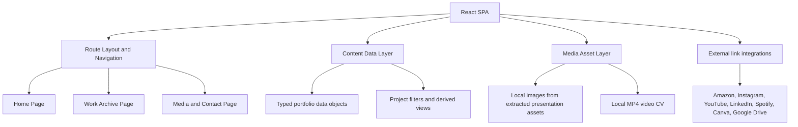
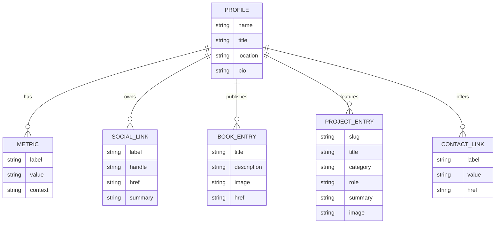

## 1. Architecture Design


## 2. Technology Description
- Frontend: React@18 + TypeScript + Vite
- Styling: Tailwind CSS@3 with custom theme tokens, utility extensions, and component-level composition
- Animation: Framer Motion for staged reveals, filter transitions, and section choreography
- Icons: Lucide React
- Media handling: local static assets served from `public/assets` and imported asset modules where appropriate
- Backend: None
- Data source: typed local content configuration derived from the provided `.pptx` and `.mp4`
- Deployment target: static hosting such as Vercel or Netlify

## 3. Route Definitions
| Route | Purpose |
|-------|---------|
| / | Presents Himadri's identity, story, signature skills, experience snapshot, and featured projects |
| /work | Provides the filterable archive of campaigns, writing work, brand projects, and proof links |
| /media | Showcases books, socials, video CV, resume CTA, and collaboration contact options |

## 4. API Definitions
No backend API is required. The application uses static, typed content objects loaded inside the frontend.

```ts
type SocialLink = {
  label: string;
  handle: string;
  href: string;
  summary: string;
};

type BookEntry = {
  title: string;
  description: string;
  image: string;
  href: string;
};

type Metric = {
  label: string;
  value: string;
  context: string;
};

type ProjectEntry = {
  slug: string;
  title: string;
  category: "campaign" | "social-strategy" | "writing" | "production" | "paid-project" | "personal";
  role: string;
  summary: string;
  contribution: string[];
  outcomes?: string[];
  tools?: string[];
  image: string;
  hrefs?: { label: string; href: string }[];
  featured?: boolean;
};

type ContactLink = {
  label: string;
  value: string;
  href: string;
};
```

## 5. Data Model
### 5.1 Data Model Definition


### 5.2 Data Definition Language
No database DDL is required because the website is a static frontend application with local content data.

## 6. Implementation Notes
- Create a reusable page shell with persistent navigation, section transitions, and a consistent editorial background treatment.
- Store all extracted presentation imagery and the provided MP4 under a clean asset structure so the final site does not depend on the original `.pptx`.
- Normalize all outbound URLs from the presentation into a single content source file for maintainability.
- Use accessible semantic HTML, visible focus states, keyboard-operable filters, and descriptive labels for all external links and media.
- Add optional video poster imagery and lazy-loading for heavy media sections to keep the site performant.
